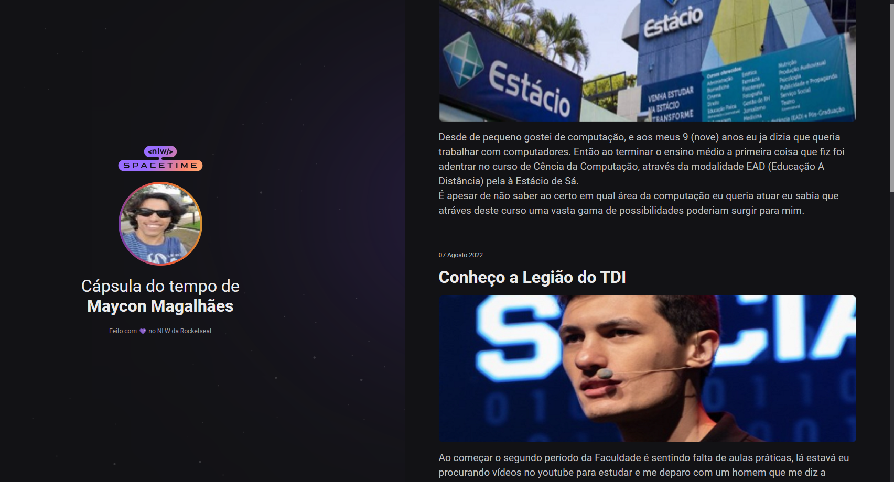

# My_Time_Capsule- 🎻

🧠 Projeto de Front-End 6 🖥️
============================
💻 Tecnologias 🖥️

Esse projeto foi desenvolvido durante o NLW da Rocketseat:

Aqui se Encontra um projeto de capsula do tempo onde eu conto um pouco da minha jornada no universo da programação e meus objetivos, além de mencionar pessoas que me inspiram; Esse projeto utilizando Html & Css (-Git & GitHub para armezanamento) e epenas uma apresentação, porém o projeto possui um link para videos específicos em cada "slide" da história descrita.

